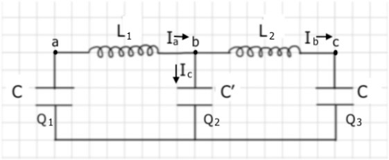
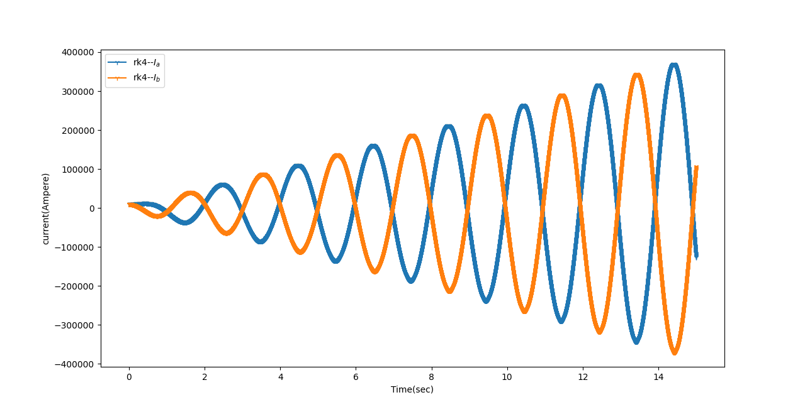

### SETUP
Paste the code in coupled_euler.py in a python file in the working directory and make another new .py file

Now, use this command to import all the functions and class definitions in coupled_euler.py 

```python
from coupled_euler import *
```
Also make the following imports,

```python
import numpy as np
import matplotlib.pyplot as plt
```
### THE PROBLEM

#### CIRCUIT DIAGRAM

#### MATH

Applying KVL in two inner loops,
$$
\begin{equation}
    L\frac{dI_b}{dt} = C'^{-1}Q_2 - C^{-1}Q_3 - R I_b
\end{equation}
$$
$$
\begin{equation}
    L\frac{dI_b}{dt} = C'^{-1}Q_2 - C^{-1}Q_3 - R I_b
\end{equation}
$$

Now, applying KCL at node b, 
$
\begin{equation}
    I_a = I_b + I_c
\end{equation}
$
In our case setting internal resistance R of inductors zero
$$
\begin{equation*}
    \frac{dQ_1}{dt} = -I_a, \frac{dQ_2}{dt} = -I_a - I_b, \frac{dQ_3}{dt} = I_b
\end{equation*}
$$
#### CODE
Now to play with initial value problem understand and use the following code which can also be found in [here](.,/coupled_oscillations.py).

```python class:"lineNo"

#l stands for inductance L , c1, c2 corresponds to C and C' 
l,c1,c2 = 0.1,1,1.3
#resistance
r=0
ivp = set_problem(
    f=[lambda t,x,y,q1,q2,q3 : (q1/c1 - q2/c2 -r*x)/l, #Function associated with (1)
    lambda t,x,y,q1,q2,q3 :(q2/c2 - q3/c1 -r*y)/l, #Function associated with (2)
    lambda t,x,y,q1,q2,q3 : -x , #Function associated with dq1/dt
    lambda t,x,y,q1,q2,q3 : -x-y, #Function associated with dq2/dt
    lambda t,x,y,q1,q2,q3 : y], #Function associated with dq3/dt
    dom=(0,15), # Time Domain 
    ini=(0,10000,10000,1,0,-1), #initial conditions in ordered tuple(t,I_a,I_b,q1,q2,q3)
    N=int(20000) # No. of nodes/ control step size
    )

d=ivp.rk4() # rk4 called to solve the ivp problem
fig,ax = plt.subplots(1,1) 
ivp.jt_plot(ax,1) # plots I_a vs t on ax
ivp.jt_plot(ax,2) # plots I_b vs t on ax

#ivp.jt_plot(ax,3) # plots q1 vs t
#ivp.jt_plot(ax,5) # plots q3 vs t
#ivp.kj_plot(ax,3,5) # plots q3 vs q1
#ivp.kj_plot(ax,1,2) # plots I_b vs I_a on ax

plt.show()
```
The result that I obtain for specifically the above Initial value problem,

which is clearly not what one expects.

